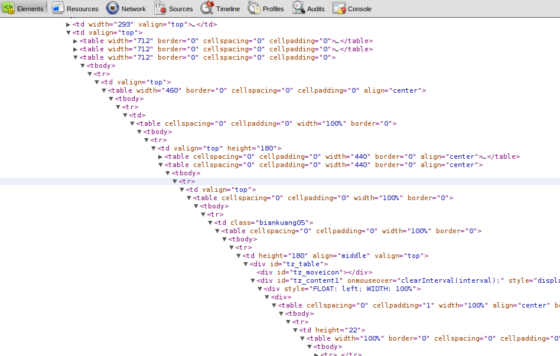
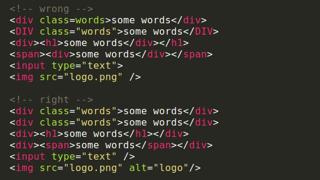
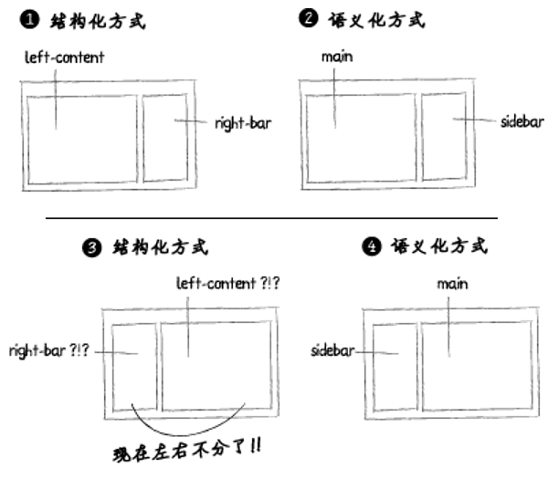
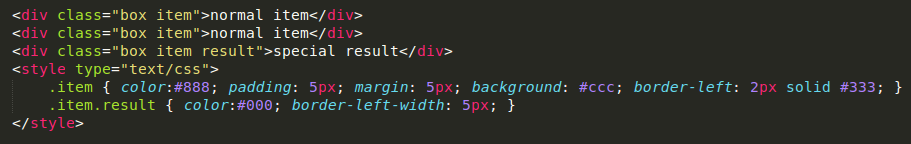
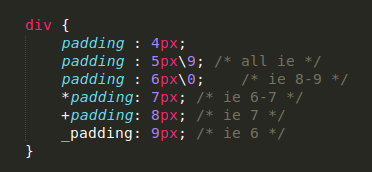
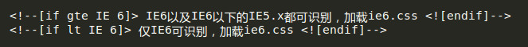
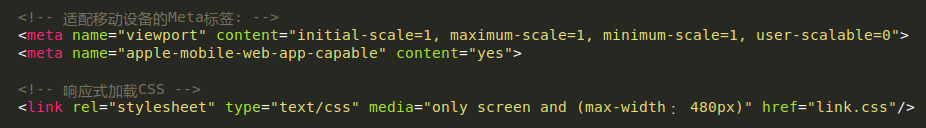
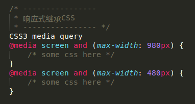
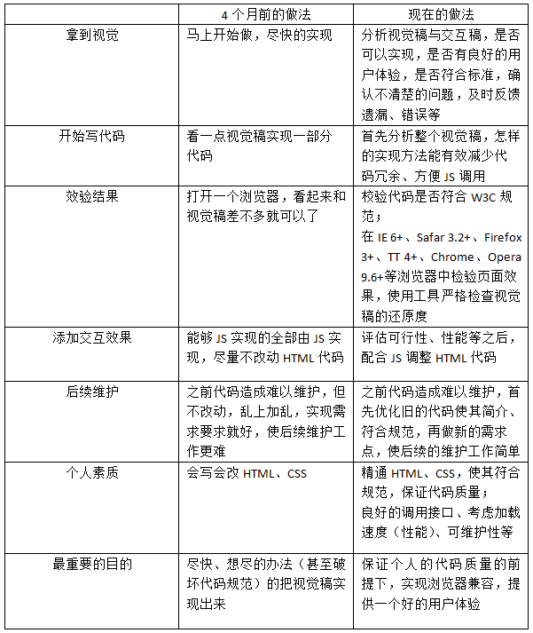

中二病也要学页面重构
=====

#中二病也要学页面重构

=====

##About Me

- 严庆文
- 二次元居民
- 信息学院09网络工程
- 大二末开始接触前端开发
- 工程师中的(伪)设计师，设计师中的(伪)工程师
- 2012.05 - 2012.10在腾讯广州微信研发中心实习页面重构 & JS开发

*****

- Email: [yqtaku@gmail.com](mailto:yqtaku@gmail.com)
- Blog: [yqtaku.github.com](http://yqtaku.github.com)

=====

##大纲

1. ###什么是页面重构

	- 过去的页面重构
	- 现在的页面重构

2. ###如何成为重构工程师
	
	- 入门需知
	- 学习方法
	- 重构三步 之 分析设计稿
	- 重构三步 之 切图
	- 重构三步 之 HTML+CSS

3. ###页面重构的职业发展

=====

#什么是页面重构

=====

##当年的页面重构

### 中国互联网的兴起，网页三剑客

- Flash => 闪客帝国之崛起
- Firework/Photoshop => 各种素材制作
- Dreamweaver => 网页如雨后春笋

### table布局的问题

- 放错位置的资源
- 加载速度慢
- 嵌套严重，结构复杂，难以维护
- 改版成本大
- 不符合WEB标准，读屏器无法识别

=====

##table布局

=====

##页面重构 ≈ (table布局 => HTML+CSS)

=====

## 如今的页面重构

### 百度百科

做为一个专职的页面重构者，我们从事的工作简单的说就是“**将设计稿转换成WEB页面**”。

单纯的页面重构，所涉及到的工作内容一般是“**分析设计稿=>切图=>写HTML和CSS**”，虽然看起来很少，但要做好这份工作，绝非所想的那么容易。原因很简单：

- 工作内容单一，在时间和工作量上必会很苛刻，往往跟设计师的工作时间是3:1，即设计师给三天的时间，制作只给一天的时间完成；
- 在这种工作强度下，很多人都是靠着对这份工作的喜爱在维持着，一旦工作热情消失，很容易就会变得枯燥，保持热情也成了重构工作者（也许是所有参加工作的人）应该具备的能力。。

跟“前端工程师”所要求的有所不同，“页面重构”虽然也是“前端工程师”的一个范畴，在职业化中，对专职的页面重构者，要求当然也更高。不单是做出页面，而是做出好页面。又引出另一个话题，“何为好页面？”，一般包括下面几点：

- 结构完整，可通过标准验证
- 标签语义化，结构合理
- 充分考虑到页面在站点中的“作用和重要性”，并对其进行有针对性的优化

=====

#如何成为重构工程师

=====

##入门需知

###页面重构工程师所应具备技能

- HTML
- CSS
- Photoshop/Firework/GIMP
- JavaScript
- 一门后端语言（至少了解）
- 理性与感性的平衡
- . . . ([思维导图1](res/skill-tree.jpg "思维导图1") [思维导图2](res/skill-tree2.png "思维导图2"))

###页面重构的工具

- 各种浏览器
- [文本编辑器](http://www.sublimetext.com/ "sublime text 2")
- Photoshop/Firework/GIMP
- [MarkMan](http://www.getmarkman.com/ "MarkMan")
- . . .

=====

##学习方法

###丰富的学习资料

- 入门神殿W3School [EN](http://www.w3schools.com/ "W3school EN") [CN](http://www.w3school.com.cn/index.html "W3school CN") 
- [盒状模型](res/box-model.gif "盒状模型")
- [各种CSS版式布局](http://www.aa25.cn/layout/index.shtml "各种CSS版式布局")
- [原生JavaScript练习](http://www.g0734.com/ "原生JavaScript练习")

###Copy是检验真理的“唯一”标准

- 各种布局定位
- 滑动门(九宫格)
- 图片轮播
- 下拉菜单
- 弹出窗口
- 瀑布流
- 视差滚动
- 回到顶部
- 博客主题 (wordpress)
- . . .

=====

##页面重构工作流程

### 七大阶段：

1. 查看设计稿，阅读需求文档、原型图；
2. 查看并分析设计稿，在脑中整理出粗略解决方案；
3. 切图、合并图片；
4. 书写HTML代码、CSS代码；
5. 检查浏览器兼容性；
6. 对比设计稿，检查还原度；
7. 开发联调修改，测试解BUG，上线后再确认一遍页面无BUG。

### 简单来说

- 设计稿
- 切图
- 敲代码

<!-- [一个重构MM的4个月的变化](res/experience.png "一个重构MM的4个月的变化") -->

=====

## 页面重构 之 分析设计稿

### 逐步分析

1. 分清设计稿中的公共与私有的部分
2. 对各部分的实现方式有一个初步的方案（包括如何切图、写结构、写样式）
3. 准确的给出各部分的实现方案（包括如何切图、写结构、写样式）
4. 能同时考虑方案的扩展性、复用性及页面性能（包括如何切图、写结构、写样式）
5. 考虑整站的结构分布（包括文件分布、目录结构）

### 案例

- [设计稿1](res/layout.jpg "设计稿1")
- [设计稿2](res/layout2.jpg "设计稿2") 

=====

## 页面重构 之 切图

### 逐步实现

1. 切成所需要的图片（如何将需要的部分切出来）
2. 对切出来的图片进行一些优化（包括压缩文件大小、选择图片类型）
3. 规划切出来的图片（包括文件分布）
4. 考虑整体的性能（包括合并图片、压缩文件大小）

### 任何一个网站都是教材

- [Alipay](https://www.alipay.com/index.html "CSS Sprite") [Res](res/icon-alipay.png) 
- [Sina Res](res/icon-sina.png)

=====

## 页面重构 之 HTML+CSS

### 逐步实现

1. 还原设计稿视觉效果，并通过标准验证（HTML）
2. 实现多浏览器的兼容（HTML）
3. 标签语义化（HTML）
4. 选择较优的实现方式（包括模块化结构，方便程序脚本使用，HTML和CSS）

**结构(HTML)、表现(CSS)与行为(JavaScript)三者分离**

=====

## 页面重构 之 HTML+CSS

###W3C标准验证(不能因为浏览器的大方，而原谅自己的不严谨)

=====

## 页面重构 之 HTML+CSS

### 什么是HTML语义

<table>
	<tbody>
		<thead>
			<tr>
				<th scope="col" width="70">标签名</th>
				<th scope="col" width="170">英文全拼</th>
				<th scope="col" width="220">中文翻译</th>
			<tr/>
		</thead>
		<tr>
			<td>h1-h6</td>
			<td>header1~header6</td>
			<td>标题1~标题6</td>
		</tr>
		<tr>
			<td>p</td>
			<td>paragraph</td>
			<td>段落</td>
		</tr>
		<tr>
			<td>ul</td>
			<td>unordered list</td>
			<td>无序列表</td>
		</tr>
		<tr>
			<td>ol</td>
			<td>ordered list</td>
			<td>有序列表</td>			
		</tr>
		<tr>
		<td>li</td>
			<td>list item</td>
			<td>列表项目</td>
		</tr>
		<tr>
			<td>dl</td>
			<td>definition list</td>
			<td>定义列表</td>			
		</tr>
		<tr>
			<td>dt</td>
			<td>definition term</td>
			<td>定义列表术语</td>
			
			</tr>
		<tr>
			<td>dd</td>
			<td>definition description</td>
			<td>定义列表描述</td>
		</tr>
		<tr>
			<td>pre</td>
			<td>preformatted</td>
			<td>预定义格式</td>
		</tr>				
		<tr>
			<td>span</td>
			<td>span</td>
			<td>范围</td>
		</tr>
		<tr>
			<td>div</td>
			<td>division</td>
			<td>分隔</td>
		</tr>
	</tbody>
</table>

=====

##页面重构 之 HTML+CSS

###为什么要写语义化的HTML

1. 去掉或样式丢失的时候能让页面呈现清晰的结构。
2. 屏幕阅读器（如果访客有视障）会完全根据你的标记来“读”你的网页。
3. PDA、手机等设备可能无法像普通电脑的浏览器一样来渲染网页（通常是因为这些设备对CSS的支持较弱）。
4. 搜索引擎的爬虫也依赖于标记来确定上下文和各个关键字的权重。
5. 你的页面是否对爬虫容易理解非常重要,因为爬虫很大程度上会忽略用于表现的标记,而只注重语义标记。
6. 便于团队开发和维护。

###如何语义化HTML

- 将内容放到各自适合的盒子里面。
- 重要的内容置前

###如何检查语义化HTML

[CSS裸奔](http://store.apple.com/us)

=====

## 页面重构 之 HTML+CSS

### 语义化id/class命名

=====

## 页面重构 之 HTML+CSS

### 通过CSS的继承，统一样式，区分特殊，减轻工作量

简单来说就是寻找共性(**语义的共性而非表现的共性**)，不要使用 `class="red bold box"` 之类的命名
	

normal item

normal item

special result

=====

## 页面重构 之 HTML+CSS

### CSS优先级记忆

<table>
	<thead>
		<th scope="col" width="180">选 择 器</th>
		<th scope="col" width="100">特 殊 性</th>
		<th scope="col" width="180">以10为基数的特殊性</th>
	</thead>
	<tbody>
		<tr>
			<td>style=""</td>
			<td>1,0,0,0</td>
			<td>1000</td>
		</tr>
		<tr>
			<td>#wrapper #content {}</td>
			<td>0,2,0,0</td>
			<td>200</td>
		</tr>
		<tr>
			<td>#content .datePosted {}</td>
			<td>0,1,1,0</td>
			<td>110</td>
		</tr>
		<tr>
			<td>div#content {}</td>
			<td>0,1,0,1</td>
			<td>101</td>
		</tr>
		<tr>
			<td>#content {}</td>
			<td>0,1,0,0</td>
			<td>100</td>
		</tr>
		<tr>
			<td>p.comment .dateposted {}</td>
			<td>0,0,2,1</td>
			<td>21</td>
		</tr>
		<tr>
			<td>p.comment{}</td>
			<td>0,0,1,1</td>
			<td>11</td>
		</tr>
		<tr>
			<td>div p {}</td>
			<td>0,0,0,2</td>
			<td>2</td>
		</tr>
		<tr>
			<td>p {}</td>
			<td>0,0,0,1</td>
			<td>1</td>
		</tr>
	</tbody>
</table>

=====

##页面重构 之 HTML+CSS

### 让IE6安享晚年，尽量避开兼容性问题，不得已才用CSS HACK

### 如果需要大量hack，最好独立加载ie678.css

如果有条件，使用虚拟机而不使用IEtester。

最好的办法是“**渐进增强**”，IE6一把年纪了，别再给他那么多负担。

=====

##页面重构 之 HTML+CSS

### 针对移动端的meta, 响应式加载CSS

###响应式继承CSS

=====

## 一个重构MM的4个月的变化

=====

#页面重构的职业发展

=====

##页面重构的职业发展

###前端开发 => 页面重构 or JS开发 => （大）前端开发

- **页面重构**关注高质量还原设计稿与页面性能；**JS开发**关注前端功能的实现与执行效率；
- **页面重构**需要了解设计师的想法；**JS开发**需要了解后端工程师的想法；
- **页面重构**偏艺术，需要想象力；**JS开发**偏程序，需要逻辑思维；
- **页面重构**关注CSS3，用代码实现各种效果；**JS开发**关注HTML5，了解新的JS API。

而前端开发则涵盖两者的技能，并在后端开发、UI设计、交互体验等多方面有所涉及。游走于理性与感性之间，是工程师中的设计师，设计师中的工程师。是两极（UI、交互 & JS开发、后端）之间沟通的桥梁，甚至是他们的老师。

### 页面重构的未来是一个N字路口

- 页面重构
- JS开发
- 前端开发
- 设计类
- 产品类

**坚持信仰，脚踏实地，对自己负责，YY始终是YY**

=====

##文章 & 网站推荐

### 文章:

- [我的重构初体验](http://tid.tenpay.com/?p=2328 "我的重构初体验")
- [重拾热情之：页面重构都在做什么？](http://cued.xunlei.com/log-010 "重拾热情之：页面重构都在做什么?")
- [小谈页面重构该如何提升？](http://www.75team.com/archives/277 "小谈页面重构该如何提升？")
- [你是一个职业的页面重构工作者吗？](http://www.cssforest.org/blog/index.php?id=121 "你是一个职业的页面重构工作者吗？")
- [再读《你是一个职业的页面重构工作者吗？》](http://www.cssforest.org/blog/index.php?id=125 "再读《你是一个职业的页面重构工作者吗？》")
- [再谈语义化](http://ued.ctrip.com/blog/?p=2735)
- [语义化的HTML结构到底有什么好处？](http://www.css88.com/archives/1668)
- [CSS代码命名惯例语义化的方法](http://blog.bingo929.com/css-coding-semantic-naming.html)
- [前端开发过程中图片格式的选择jpg，png还是gif？](http://www.niumowang.org/html-css/jpg-png-gif/ "前端开发过程中图片格式的选择jpg，png还是gif？")

### 网站:

- [W3Schools](http://www.w3schools.com/ "W3Schools")
- [前端观察](http://www.qianduan.net/ "前端观察")
- [CSS森林](http://www.cssforest.org/blog/ "CSS森林")
- [有哪些不错的前端开发博客？ - 知乎](http://www.zhihu.com/question/19951193 "有哪些不错的前端开发博客 - 知乎")
- . . .

=====

#END
